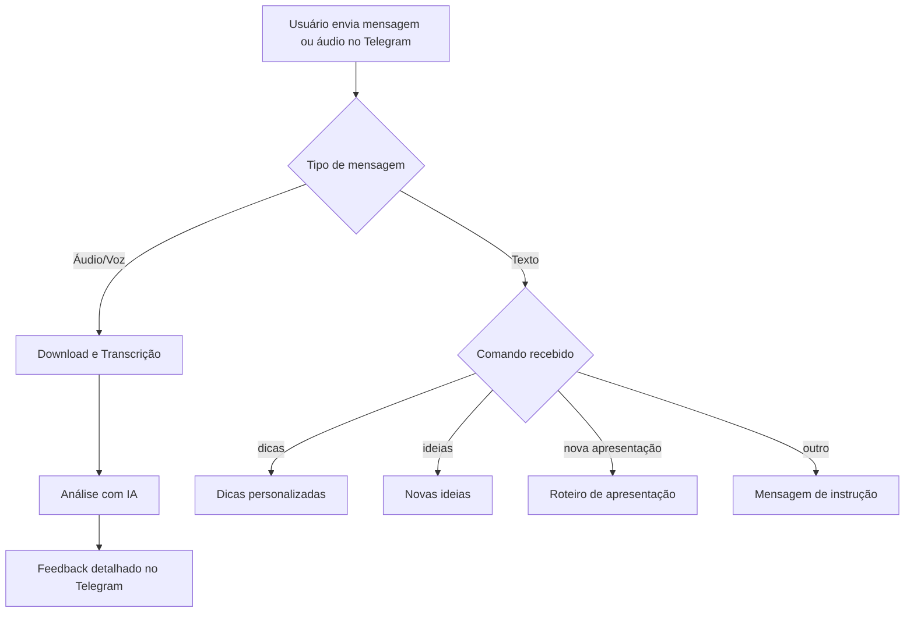

# Oratória Lendária

**Oratória Lendária** é um bot de Telegram desenvolvido com n8n e inteligência artificial (OpenAI) para analisar áudios de palestras, oferecer dicas de melhoria, sugerir novas ideias e gerar roteiros de apresentações, tudo de forma personalizada para cada usuário.

---

## Sumário

- [Visão Geral](#visão-geral)
- [Principais Funcionalidades](#principais-funcionalidades)
- [Fluxo Geral](#fluxo-geral)
- [Detalhamento dos Agentes](#detalhamento-dos-agentes)
- [Memória e Personalização](#memória-e-personalização)
- [Tecnologias Utilizadas](#tecnologias-utilizadas)
- [Observações e Boas Práticas](#observações-e-boas-práticas)

---

## Visão Geral

O Oratória Lendária transforma o Telegram em um ambiente de aprendizado para palestrantes e educadores, permitindo que você envie áudios ou comandos de texto para obter feedback imediato e sugestões personalizadas sobre sua oratória e conteúdo.

---

## Principais Funcionalidades

### Análise de Áudio

- Receba feedback detalhado sobre pontos fortes e fracos da sua fala.
- Sugestões de melhoria didática, linguagem e exemplos criativos.
- Relatórios segmentados em:
  - **Análise da abordagem**
  - **Sugestões de melhoria**
  - **Ideias criativas**

### Comandos de Texto

Envie comandos simples para acessar outras funções:

| Comando               | Resultado                                                                 |
|-----------------------|--------------------------------------------------------------------------|
| `dicas`               | Receba dicas detalhadas para melhorar sua oratória, baseadas no histórico |
| `ideias`              | Novas ideias para enriquecer suas palestras                               |
| `nova apresentação`   | Geração automática de um roteiro de apresentação                          |

### Geração de Apresentação

- Criação de novos roteiros personalizados com tema, tópicos, abordagem e público-alvo, evitando repetições.
- Respeito ao histórico do usuário para gerar conteúdos sempre inéditos.

---

## Fluxo Geral

## Detalhamento dos Agentes

| Agente                | Função Principal                                         | Entradas                 | Saída para o usuário        |
|-----------------------|---------------------------------------------------------|--------------------------|-----------------------------|
| **Audio Agent**       | Análise de áudios/vozes, transcrição, feedback IA       | Áudio/Voz Telegram       | Relatório detalhado         |
| **Tips Agent**        | Dicas detalhadas com base no histórico do usuário        | Comando `dicas`          | Dicas de oratória           |
| **Ideas Agent**       | Geração de novas ideias, exemplos, abordagens inéditas   | Comando `ideias`         | Ideias para palestras       |
| **Presentation Agent**| Geração de roteiro de apresentação                       | Comando `nova apresentação`| Roteiro estruturado       |

---

## Memória e Personalização

- Todo feedback e sugestão utiliza **memória persistente** via banco de dados Postgres.
- A memória é **segmentada por usuário** (`session_id`), garantindo respostas personalizadas e evolução contínua.
- Diferentes agentes mantêm **memórias separadas** para feedback, dicas, ideias e apresentações.

---

## Tecnologias Utilizadas

- **n8n**: Orquestração de fluxos e automações.
- **Telegram Bot API**: Comunicação com o usuário.
- **OpenAI (GPT-4)**: Transcrição de áudios e análise inteligente.
- **PostgreSQL**: Persistência de histórico e memória contextual.
- **LangChain**: Integração entre IA, memória e dados.

---

## Observações e Boas Práticas

- Todas as mensagens respeitam o limite de caracteres do Telegram.
- O bot tenta distinguir diferentes interlocutores no áudio sempre que possível.
- Comandos e interações são simplificados para facilitar o uso por iniciantes.

---

## Exemplo de Uso

1. **Envie um áudio da sua palestra** pelo Telegram:  
   O bot transcreve, analisa e retorna um relatório detalhado de melhorias.
2. **Digite `dicas`** para receber sugestões mais profundas com base no seu histórico.
3. **Digite `ideias`** para obter sugestões inéditas e criativas.
4. **Digite `nova apresentação`** para receber um roteiro completo de palestra, já considerando temas, tópicos e público-alvo.

---

Para dúvidas ou colaboração, fique à vontade para abrir uma issue ou contribuir com melhorias!
